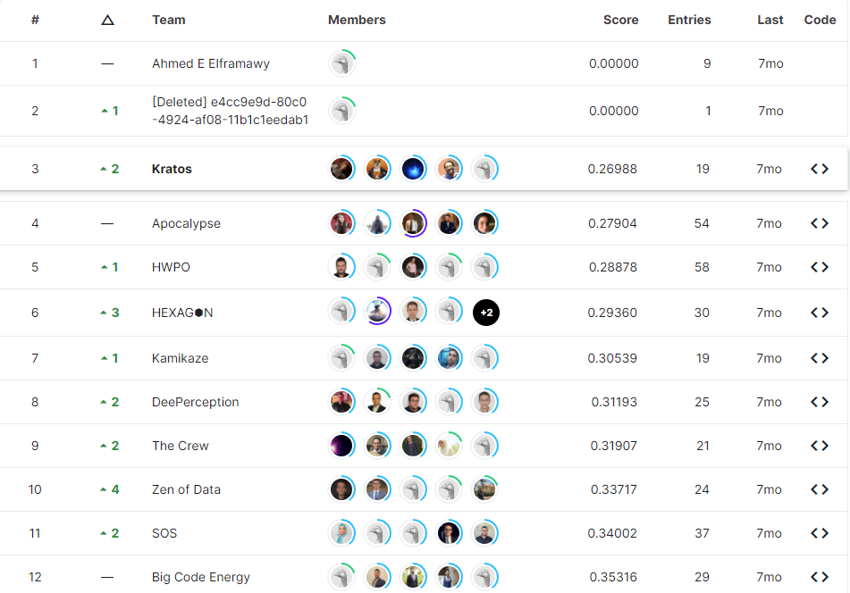

# Seoul-Bike-Rental-Prediction-Competition

This is For [InClass Prediction Competition](https://www.kaggle.com/c/seoul-bike-rental-ai-pro-iti)

---

## description 
- the goal was to predict the bikes rental number in any day based on some weather forcast and the day of the week it self 
- You are provided hourly rental data along with weather data. For this competition, the training set is comprised of the first 20 days of each month, while the test set is the 21th to the end of the month. You must predict the total count of bikes rented during each hour covered by the test set, using only information available prior to the rental period.
- ---

## File descriptions
- train.csv - the training set.
- test.csv - the test set.
- sample_submission.csv - a sample submission file in the correct format

---

## Data fields
* ID - an ID for this instance
* Date - year-month-day
* Hour - Hour of he day
* Temperature - Temperature in Celsius
* Humidity - %
* Windspeed - m/s
* Visibility - 10m
* Dew point temperature - Celsius
* Solar radiation - MJ/m2
* Rainfall - mm
* Snowfall - cm
* Seasons - Winter, Spring, Summer, Autumn
* Holiday - Holiday/No holiday
* Functional Day - NoFunc(Non Functional Hours), Fun(Functional hours)
* y - Rented Bike count (Target), Count of bikes rented at each hour

---

## Technologies and algorithms used

### algorithms

* XGBoost (Deprecated)
* GBRegressor (Deprecated)
* Random Forest (Deprecated)
* CatBoost (Used)
### technologies

* k_folds 
* Bagging
### Feature Engineering and Preprocessing 

* A) The Hourly cycle has a good correlation. [7am-18pm has the bigger share]
* B) The Temperature has good corr. [high is good except > ~ 27]
* C) The Functional Day has good corr. [functional is good for target]
* D) The Seasons has good corr. [hot season is better]
* E) The Visibility may prove to be good. [if encoded to very_low visibility vs normal visibiliy].
* F) The RainFall/SnowFall may prove to be good. [if encoded to Snowing / Raining or not].
* G) The Humidity may have something to investigate. [if encoded as 0-80 % normal rentals, 80-100% show sharp decay in rentals]
* H) the Dew point temperature is strongly corr to Temperature will drop it, if using a linear model.
* I) the Solar Radiation may be discarded .. i didn't see good relation. if using a linear model also.
* J) the holidays didn't prove decisive saying on our target. maybe discarded too.

* In order to get more features that may help the model understanding relationships among variables, we tended to collect our domain knowledge about the problem, and gathered most of it through searching, thinking, and visualizing. Clustering Weather-State, Sky-State, Day-Night & more, came along from this Point.

* Using The Temp column to create Humidex

### Training The Model

Trained using Kaggle CPU

---

## final Score 

* CatBoost RMSLE Test:  0.2109200622111003
* CatBoost RMSLE Train:  0.08459376775468527
* CatBoost R2 Test:  0.9970479763039405
* CatBoost R2 Train:  0.99945203721597

---
## Final result

the first 2 was cheaters that used the real data for submission

